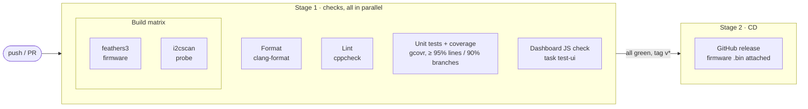

# vqf-gps-vibes

[](https://github.com/Tsmorz/vqf-gps-vibes/actions/workflows/ci.yml)
[](https://github.com/Tsmorz/vqf-gps-vibes/actions/workflows/ci.yml)

Real-time orientation and position estimation on an **Unexpected Maker FeatherS3**
(ESP32-S3), streamed to a browser over the board's own WiFi access point.

Orientation comes from [VQF](https://github.com/dlaidig/vqf) (Laidig & Seel,
*Information Fusion*, 2023). Position and velocity come from a 9-state extended
Kalman filter driven by the accelerometer and corrected by GPS with ordinary
linear measurement updates — a loosely-coupled INS/GNSS filter sitting on top of
VQF's attitude solution.

## Hardware

| Part | Bus | Address | Rail |
|---|---|---|---|
| Unexpected Maker FeatherS3 (ESP32-S3, 16 MB flash) | — | — | — |
| Adafruit LSM6DSOX + LIS3MDL breakout | bus 0 "imu", `SDA 8 / SCL 9` | `0x6A`, `0x1C` | LDO1 |
| Adafruit Mini GPS PA1010D | bus 1 "aux", `SDA1 16 / SCL1 15` | `0x10` | LDO2 |
| Adafruit BMP390 pressure/temperature | bus 1 "aux", `SDA1 16 / SCL1 15` | `0x77` | LDO2 |

Run `task scan` before anything else — it scans **both** buses and prints what
answers on each.

### Why the sensors are split across two buses

They all started on one STEMMA run, and that made the GPS's intermittent
connector a system-wide fault: one 20-second capture had 113 frames in which the
accelerometer, gyroscope **and** magnetometer were simultaneously dead, because a
glitch on shared lines corrupts every transfer on them. The GPS is also the
heaviest consumer of bus time — a 32-byte refill costs ~2.9 ms at 100 kHz against
a 5 ms estimator tick.

So the latency-critical IMU gets a short bus to itself, and the slow, physically
less reliable devices share the other. Every transfer on a bus is still issued
from a single task, so two cores can never interleave transactions on it.

### Power rails

LDO1 is always on and feeds the ESP32-S3 and the IMU. **LDO2 is switchable, gated
by GPIO 39**, and feeds the 3V3 pin — here the GPS and barometer.

GPIO 39 is also `RGB_PWR`: the variant header defines `LDO2` and `RGB_PWR` as the
same pin, so the onboard LED shares that rail. Two consequences:

- **Never drive GPIO 39 low to turn the LED off** — it would cut power to two
  sensors. Send a black pixel instead.
- The rail must be up *and settled* before those sensors are initialised, which is
  why `BoardPowerBegin()` is a deliberate first step in `setup()` rather than a
  side effect of the LED coming up.

The switchable rail also buys a recovery option the IMU does not have: an aux
sensor wedged badly enough to ignore its own bus can simply be power-cycled, and
that is the top of the escalation ladder in `I2cServiceWatchdog()`.

### BOOT button and deep sleep

The FeatherS3's **BOOT** button (GPIO 0) is the board's only physical input:

| Press | Action |
|---|---|
| Short | Start a magnetometer sweep; press again to finish it |
| Long (1.5 s) | Deep sleep. Press BOOT again to wake |

Going to sleep is a three-step handoff, because the I2C buses belong to the
estimator task: `loop()` asks the estimator to power the IMU down and waits for
it to confirm (bounded at 500 ms), then cuts LDO2 and enters deep sleep.

- **IMU** — the LSM6DSOX accel/gyro data rates are set to shutdown and the
  LIS3MDL to power-down. They sit on LDO1, which stays powered, so without this
  they would sample continuously through the sleep.
- **GPS, barometer, LED** — LDO2 is driven low and latched off with a GPIO hold
  that `BoardPowerBegin()` releases on the next boot.
- **Wake** — GPIO 0 is RTC-capable on the ESP32-S3, so it is armed as an `ext0`
  wake source (active low, RTC pull-up). The board waits for the button to be
  released before sleeping, or the low level would end the sleep at once.

Wake is a full reboot: the access point restarts and the VQF/EKF state is lost.
The magnetometer calibration survives, since it lives in NVS. GPIO 0 is also a
strapping pin (held low at reset it selects the ROM bootloader); wake-by-button
is expected to boot normally, but confirm it on your board.

Not done: waking on motion. The LSM6DSOX can raise INT1 on wake-up/activity
detection, but that pin is not on the STEMMA connector and would need a jumper to
an RTC-capable GPIO.

## Quick start

```bash
brew install go-task clang-format node   # node is only needed for `task test-ui`
pip install platformio
task init            # fetch toolchains, libraries, and create src/secrets.h
task flash           # build, flash, open the serial monitor
```

## Networking

The board picks its own mode on boot, so the same firmware works at a desk and
in a field:

- **Station** — if `WIFI_SSID` in `src/secrets.h` (git-ignored, created by
  `task init`) names a network that answers within 8 s, the board joins it and
  advertises itself over mDNS at **<http://vqf-gps.local/>**. Convenient at a
  desk: the dashboard is reachable from a machine that still has internet.
- **Access point** — otherwise, which is what happens the moment you carry the
  board out of range, it serves its own network **`vqf-gps`** (password
  `vqfgps123`) at **<http://192.168.4.1/>**.

Leave `WIFI_SSID` empty to always be an access point. The serial log prints
which mode won and the address to open.

## Commands

| Task | What it does |
|---|---|
| `task build` | Compile the firmware |
| `task flash` | Build, flash, open the serial monitor |
| `task upload` | Build and flash without the monitor |
| `task monitor` | Serial monitor only |
| `task scan` | Flash the I2C/LED bring-up probe — use when a cable is suspect |
| `task test` | Host unit tests (EKF, geodesy, telemetry encoder) |
| `task coverage` | Host unit tests instrumented with gcov; HTML report in `.pio/coverage/` (needs `pip install gcovr`) |
| `task test-ui` | Run the dashboard's JavaScript headlessly against a real frame |
| `task lint` | cppcheck static analysis |
| `task format` / `format-check` | clang-format (Google style, 4-space indent) |
| `task ci` | Everything above, in CI order |
| `task erase` | Erase all flash |

## CI/CD

[`.github/workflows/ci.yml`](.github/workflows/ci.yml) runs on every push to
`main` and every pull request. Each check is its own job, so they run **in
parallel** on separate runners and a failure in one does not hide the others.
Publishing waits for all of them.



| Job | Runs | Fails when |
|---|---|---|
| Format | `task format-check` | any source differs from clang-format 21.1.8 output |
| Lint | `task lint` | cppcheck reports a HIGH or MEDIUM finding |
| Unit tests + coverage | `task coverage` | a test fails, or coverage drops below 95% lines / 90% branches |
| Dashboard JS check | `task test-ui` | the dashboard and the telemetry encoder disagree on a field |
| Build (`feathers3`, `i2cscan`) | `pio run -e <env>` | either firmware fails to compile |
| Publish release | attaches `vqf-gps-<tag>.bin` | only runs for a `v*` tag, after every job above passes |

**Coverage** is measured with gcov on the host unit tests and reported by
`gcovr`. The per-file table appears on the run's summary page, and the full HTML
report is uploaded as the `coverage` artifact. Run `task coverage` to get the same
report locally. The figure covers the host-testable code only (the EKF, geodesy,
magnetometer calibration, sensor limits and telemetry encoder). Code that touches
Arduino or the I2C bus cannot run on a host, so it is not in the denominator.

It currently stands at **100% of lines and 98.4% of branches**. Three branches
remain: a negative variance in `IsDiverged()` and an `snprintf` returning a
negative length in `telemetry.cpp`, neither of which anything can produce
through the public API, plus one compiler-emitted edge on the progress ternary
in `mag_cal.h` whose two outcomes the tests do both exercise. They are left
alone rather than reached through a test-only back door.

The badge above is rendered by `scripts/coverage_badge.py` from the Cobertura
report, and committed by CI whenever the percentage moves — so it is the real
number rather than one kept up to date by hand.

To cut a release, tag and push: `git tag v1.0.0 && git push origin v1.0.0`.

## Dashboard

Six panels, all drawn with plain canvas — no CDN, since the board serves the page
from its own access point with no internet behind it.

- **Orientation** — the body's unit axes rotated by the VQF quaternion, against a
  faint ENU world frame. Drag to orbit.
- **IMU** — accelerometer, gyroscope and magnetometer time series.
- **Position (3D)** — the estimated trajectory in local ENU, raw GPS fixes, and
  the 3σ uncertainty ellipsoid. Drag to orbit.
- **Position vs time** — east/north/up, each with its ±3σ envelope shaded and raw
  fixes overlaid.
- **Velocity vs time** — same, for the velocity states.
- **Filter tuning** — the control knobs, below.

### Control knobs

Sliders are logarithmic, because these sigmas span orders of magnitude.

| Knob | Effect |
|---|---|
| `sigma_accel` | **The dominant process-noise term.** Sets how fast the position/velocity 3σ envelope opens between fixes. |
| `sigma_accel_bias` | Accelerometer bias random walk — how quickly bias is re-learned from GPS. |
| `sigma_gps_pos_h` / `_v` | Assumed 1σ GPS accuracy; lower values make fixes pull harder. |
| `sigma_gps_vel` | Assumed 1σ accuracy of GPS ground speed and course. |
| `sigma_zupt` | How firmly a detected rest pins velocity to zero. |
| `tau_acc` / `tau_mag` | VQF time constants for gravity (roll/pitch) and magnetometer (yaw) correction. |

Changes take effect on the next filter tick. Nothing is persisted — a reboot
returns to the defaults in `include/config.h`.

## Magnetometer calibration

A raw magnetometer measures the Earth's field **plus the board's own**. On this
hardware the uncalibrated LIS3MDL reads about 86 µT where the true local field
is about 48.6 µT, nearly all of the excess a fixed offset on one axis.

VQF cannot remove this: its magnetic disturbance rejection is built for
transient anomalies in a field it assumes is otherwise homogeneous, whereas a
hard-iron offset is fixed in the sensor frame and rotates with it. The effect is
confined to heading — measured on the bench, roll and pitch held to 0.01° while
yaw wandered 7°, because the horizontal component heading is derived from had
been squashed from ~21 µT to 7.4 µT.

To calibrate: press **Calibrate magnetometer** on the dashboard (or short-press
the **BOOT** button on the board, which is handy untethered), slowly turn the
board through every orientation including upside down until it reaches 100 %,
and press **Finish** (or BOOT again). The fit is stored in NVS and restored on boot. A sweep that
only spins about one axis is refused, since it would leave the other two
uncorrected.

The `|mag|` readout next to the button is the quickest sanity check: after a good
calibration it should sit near your local field strength (25–65 µT depending on
latitude) and stay roughly constant as you turn the board.

Accelerometer scale is a separate, smaller matter: this board reads |accel| ≈
10.12 m/s² at rest against a true 9.807, about 3 % high. That is within the
LSM6DSOX's sensitivity tolerance, and the filter's accelerometer-bias states
absorb it once GPS or zero-velocity updates make them observable.

## Barometer

The BMP390 improves height, which is the weakest axis of a GPS-only estimate.
Worth being explicit about what the part does: **it has no built-in altitude
estimation.** It reports pressure and temperature. Adafruit's `readAltitude()` is
a host-side barometric formula that takes the current sea-level pressure as an
argument — a value you do not have, and guessing the 1013.25 hPa standard is
wrong by however much the weather differs, routinely tens of metres.

So the driver does not pretend to produce absolute altitude. It reports a
*pressure altitude* against the fixed standard reference — arbitrary in absolute
terms, excellent in its changes — and the filter carries the offset as a tenth
state (`kBaroBias`). The barometer then observes *height + offset*, GPS observes
height directly, and the offset absorbs the unknown reference and weather drift.
That is the same trick as the accelerometer bias states: model the error you
cannot measure rather than pretend it is absent.

**Anchoring waits for a meaningful height.** At boot the filter free-runs: VQF
has not converged, gravity does not cancel, and height integrates away — measured
at −18 m within seconds of power-up. Anchoring against that bakes the error into
the offset, and because the barometer is trusted far more than GPS altitude it
then takes minutes to undo. So the anchor waits for the first GPS fix, which
snaps height to a known value, or for `BARO_ANCHOR_FALLBACK_MS` if no fix ever
arrives — which is the indoor case, where the barometer is the only height
reference there is.

Measured contribution, symmetric A/B on a stationary rig (30 s settle, 15 s
measure, both orders):

| | height 3σ | height sd |
|---|---|---|
| barometer on | 0.72–0.78 m | 7–23 cm |
| barometer off | 1.08 m, and **6.10 m** once GPS altitude degraded | 15 cm / 200 cm |

The envelope is tighter with it, and far more importantly it stays bounded when
GPS altitude wanders. Toggle `use barometer` on the dashboard to see this.

## Status LED

The onboard RGB LED (WS2812B on GPIO 40, power rail gated by GPIO 39) is the only
status channel before a browser is attached.

| Colour | Pattern | Meaning |
|---|---|---|
| Blue | fast pulse | Initialising — sensors and WiFi coming up |
| Green | slow breathe | Normal — estimator running, all sensors healthy, GPS has a fix |
| Amber | slow blink | Degraded — no GPS fix or module, magnetometer lost, or the tick rate has sagged |
| Red | fast blink | Error — the accelerometer/gyroscope is gone, so there is no estimate at all |
| Magenta | fast pulse | Magnetometer sweep in progress (overrides the above until finished) |

The LED goes dark before deep sleep, using a black pixel rather than GPIO 39.

## Architecture

```
core 1   estimator task, 200 Hz — owns the I2C bus         src/estimator.cpp
core 0   Arduino loop — WiFi AP, dashboard, status LED     src/main.cpp
```

```
include/config.h      pins, rates, defaults — every value overridable with -D
lib/vqf/              vendored verbatim from github.com/dlaidig/vqf (MIT)
src/
  main.cpp            setup/loop, status evaluation, serial heartbeat
  estimator.cpp/.h    the 200 Hz task: IMU -> VQF -> EKF -> snapshot
  nav_filter.h        9-state EKF (pure math, unit tested)
  geo.h               lat/lon/alt -> local ENU (pure math, unit tested)
  attitude.h          quaternion -> rotation matrix and Euler angles
  filter_params.h     the runtime-tunable knobs
  imu.cpp/.h          LSM6DSOX + LIS3MDL, with reconnect, mag calibration, power-down
  mag_cal.h           hard/soft-iron fit (pure math, unit tested)
  baro.cpp/.h         BMP390 pressure altitude
  button.cpp/.h       BOOT button: debounce, short/long press, deep-sleep entry
  board_power.cpp/.h  LDO2 control: bring-up, power-cycle, sleep latch
  status_led.cpp/.h   the RGB status patterns
  gps.cpp/.h          PA1010D, with reconnect and presence detection
  i2c_bus.cpp/.h      shared bus init and stuck-bus recovery
  telemetry.cpp/.h    snapshot -> the JSON frame the dashboard reads
  wifi_link.cpp/.h    joins your network, falls back to the board's own AP
  web_server.cpp/.h   HTTP and WebSocket
  secrets.example.h   template for the git-ignored src/secrets.h
web/index.html        the dashboard, gzipped into flash at build time
tools/i2cscan/        the bring-up probe behind `task scan`
tools/check_dashboard.mjs   headless harness behind `task test-ui`
```

### The filter

State: `[pE pN pU | vE vN vU | bx by bz]` — position and velocity in the local ENU
tangent plane anchored at the first GPS fix, plus accelerometer bias in the body
frame.

Propagation rotates the bias-corrected accelerometer into ENU using VQF's
quaternion and adds gravity. Every measurement — GPS position, GPS velocity, the
zero-velocity pseudo-measurement — observes a single state directly, so updates
are applied one scalar at a time: the Kalman gain reduces to a single column of
`P` and no matrix inversion is needed.

VQF's 9D earth frame is already ENU (z opposite gravity, the horizontal magnetic
field along +y), so its rotation matrix is used with no axis permutation. The one
caveat is declination — +y is *magnetic* north, which rotates the whole trajectory
by a fixed angle rather than causing drift.

### Zero-velocity updates

On by default. While VQF's rest detector reports the board is stationary, all
three velocity components are measured as zero. Without this, indoor testing with
no GPS fix diverges within seconds as accelerometer bias double-integrates into
runaway position error. Turn it off from the dashboard to watch exactly that
happen — the 3σ envelope opening up is the point of the plot.

## Failure handling

The STEMMA cables are fragile and the GPS often has no fix, so neither is treated
as exceptional:

- **Every chip is probed for presence on the bus, because the driver's return
  value cannot be trusted.** `Adafruit_LSM6DS::getEvent()` ends in an
  unconditional `return true;` and the `_read()` behind it is declared `void`, so
  a failed I2C transfer never reaches the caller — an unplugged LSM6DSOX reads as
  a clean `(0, 0, 0)`, which is indistinguishable from free fall. Left
  undetected this integrated to −975 m/s and −103 km in under two minutes on the
  bench. Asking the address whether anything is still there cannot be fooled the
  same way.
- With no IMU the filter coasts on its last velocity with inflated process noise,
  rather than integrating whatever the driver hands back or freezing (which would
  claim the position is still known to its old accuracy).
- Each chip tracks consecutive read failures and only goes offline after a run of
  them, so a flexing cable does not cause a re-init storm.
- Offline chips are re-initialised at most once every 2 s, and the bus is
  clock-pulsed free first in case a sensor was reset mid-transfer and is holding
  SDA low.
- The magnetometer and the accelerometer/gyroscope are tracked separately: losing
  the magnetometer costs absolute heading, and VQF keeps running on 6-DOF data.
- The GPS is probed for presence on the bus every 2 s, which distinguishes
  "unplugged" from "plugged in but still searching".
- Each GPS fix is applied exactly once. Re-applying the same fix every tick would
  shrink the covariance without new information and make the filter overconfident.
- The GPS drain is bounded by a wall-clock budget rather than a character count.
  The PA1010D pads its I2C output with `0x0A` when idle and the Adafruit library
  discards that padding, so draining by character count costs one 32-byte I2C
  transfer *per character* and collapses the tick rate.
- Divergence resets the filter. The check is about plausibility, not just NaN:
  a runaway state stays perfectly finite all the way to 100 km, so position and
  speed are bounded too.
- Orientation is restarted when the IMU reconnects — an integrated attitude means
  nothing across a gap in the data.
- Inbound commands are parsed tolerantly (whitespace around colons, `true`/`false`
  as well as `1`/`0`), so the protocol is not tied to one particular JSON encoder.

- **Serial logging never blocks the loop.** The USB-serial peripheral's
  `write()` waits for room in its ring buffer — 100 ms by default, retried up to
  twenty times, so nearly two seconds per call — and nothing drains that buffer
  unless a serial monitor is open. The once-a-second status line was therefore
  stalling `loop()` to about 1 Hz whenever the board ran untethered, which is
  its normal state. Since the web server is serviced from `loop()`, a WebSocket
  handshake that takes 15 ms with a monitor attached took **15 seconds**
  without one. `Serial.setTxTimeoutMs(0)` drops log output instead of waiting.
- WiFi modem sleep is disabled. Left on, the radio sleeps between the router's
  DTIM beacons and incoming packets sit buffered — 58–97 ms ping times on a LAN.
  The cost is higher idle current, which matters on battery.

Errors are reported as status returns, not C++ exceptions — exceptions in a 200 Hz
real-time task on an MCU would cost far more than they are worth here.

## Licence

`lib/vqf/` is vendored verbatim from <https://github.com/dlaidig/vqf> and is MIT
licensed — see `lib/vqf/LICENSE.txt`. Don't edit it; treat it as a black box with
the API documented in `vqf.hpp`.
